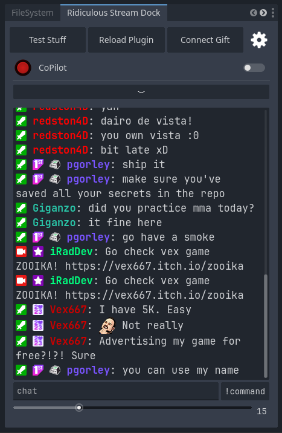
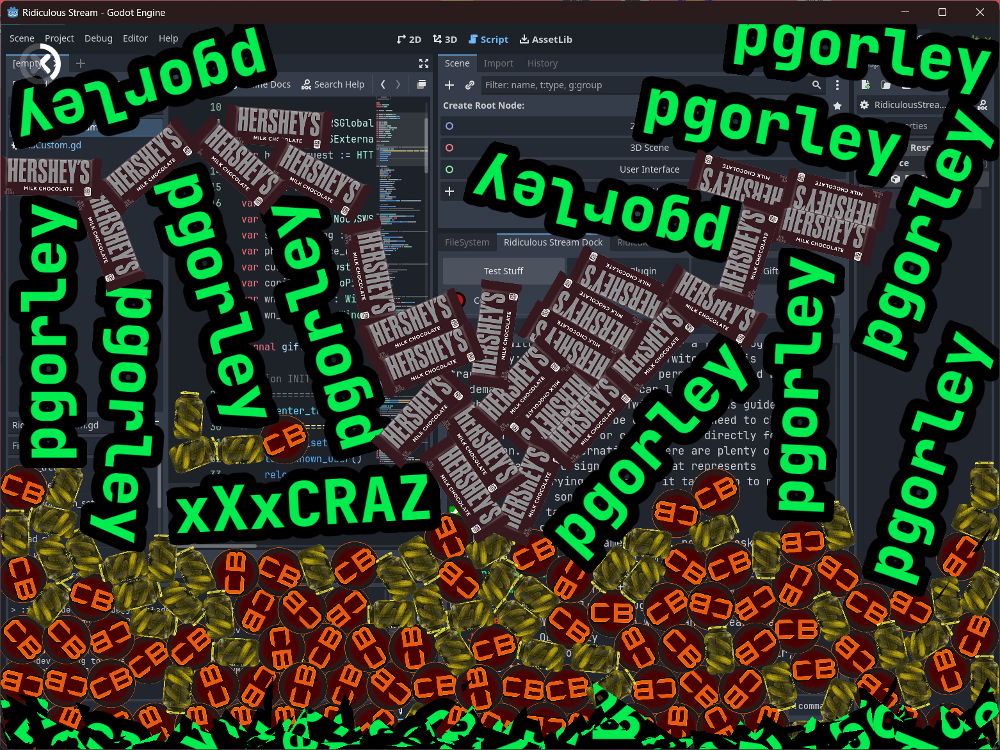
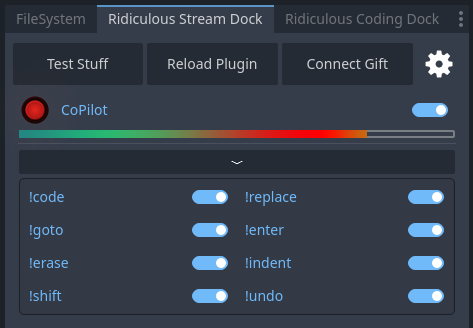
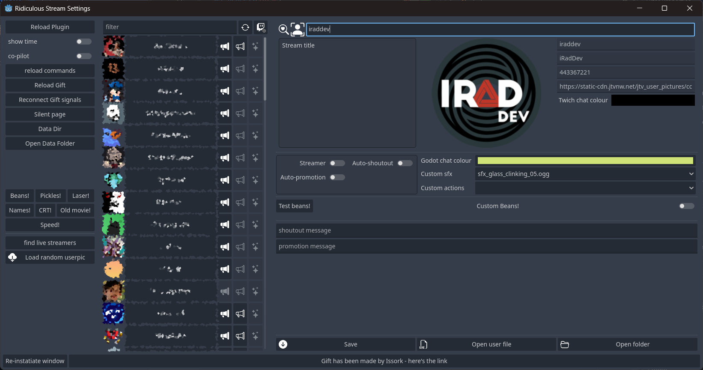

# Ridiculous Stream for Godot

Welcome to **Ridiculous Stream for Godot**, a groundbreaking plugin that integrates Twitch chat directly into the **Godot 4.x** game development environment. Created by Dario "iRad" De Vita, a passionate game developer and [Twitch streamer](twitch.tv/iraddev), this plugin is inspired by the concept of **[Ridiculous Coding for Godot](https://github.com/jotson/ridiculous_coding)** implemented by **jotson** and aims to inject an unparalleled level of interaction and *fun* into your game development process.

## Key Features

RS is a *silly little plugin*, **quite dangerous** if you ask me. You can have your editor crash while coding (*so save often!*) because the Twitch chat can spawn rigid bodies running at runtime within the editor.

- **Twitch chat integration within the ditor**: Connect to your Twitch account and have the stream chat all the time in front of you when game devving in Godot4!

- **Interactive Rigid Bodies**: Spawn interactive rigid bodies, such as cans of beans, within the Godot editor. Streamers can drag (*left-click*) or destroy (*right-click*) these objects. The first chat message from any user spawns their username in the editor, which can be interacted with in the same way. Destroyed usernames produce shards, adding a visually engaging element to your stream.

- **Chat Co-Pilot**: If you hate or love backsitting, let your viewers to write code directly inside the editor from the chat. It's not annoying or dangerous at all. Your Godot project will surely benefits from it!

- **BBCode injections in the chat**: Let your viewers decorate their text with BBcode injections.

- **customize your known user list**: 
    - Create auto-shoutout for your fellow streamers
    - Customize the RigidBody that your viewer can spawn in the editor

## Customization

- **Chat Redeems to Custom Functions**: Connect Twitch chat redeems to custom functions within Godot. This feature allows for creative and silly interactions, such as **stopping the stream** or **initiating a raid** on another streamer from a custom list of users currently streaming.

- **OBS Integration**: Control OBS directly from Godot. Implement redeems that can, for example, stop the stream entirely or raid a streamer, adding a layer of unpredictability and fun.

- **Adaptive 2D Colliders**: The bounding box for the rigid bodies is defined by 2D plane colliders on three sides (left, down, right) that adjust to the editor window size, ensuring the interactions remain contained within the visible area.

## Getting Started

To install Ridiculous Stream for Godot, follow these simple steps:

1. Download or clone this repository.
2. Copy the plugin into your project's `addons` folder.
3. Enable the plugin from Godot's project settings.

## Usage

After installation, access the Twitch chat integration through the Godot editor. Configure the plugin with your Twitch API credentials to start receiving chat directly inside Godot. Enjoy interacting with your Twitch audience in a whole new way!

## Contributing

Contributions to Ridiculous Stream for Godot are welcome! Whether it's feature development, bug fixes, or documentation improvements, feel free to fork the repo and submit a pull request.

## About the Author

Dario "iRad" De Vita [streams on Twitch](https://www.twitch.tv/iraddev) and has brought his love for engagement and community interaction into the Godot engine. With a desire to add more silliness and interactivity to his streams, iRad has developed Ridiculous Stream for Godot, leveraging his experience as a game developer and streamer to enhance the streaming experience for everyone.

Ridiculous Stream for Godot is more than just a plugin; it's a way to bring your Twitch audience into the heart of your game development process. Created with ❤️ by Dario "iRad" De Vita.

## License

This project is licensed under the MIT License - see the LICENSE file for details.